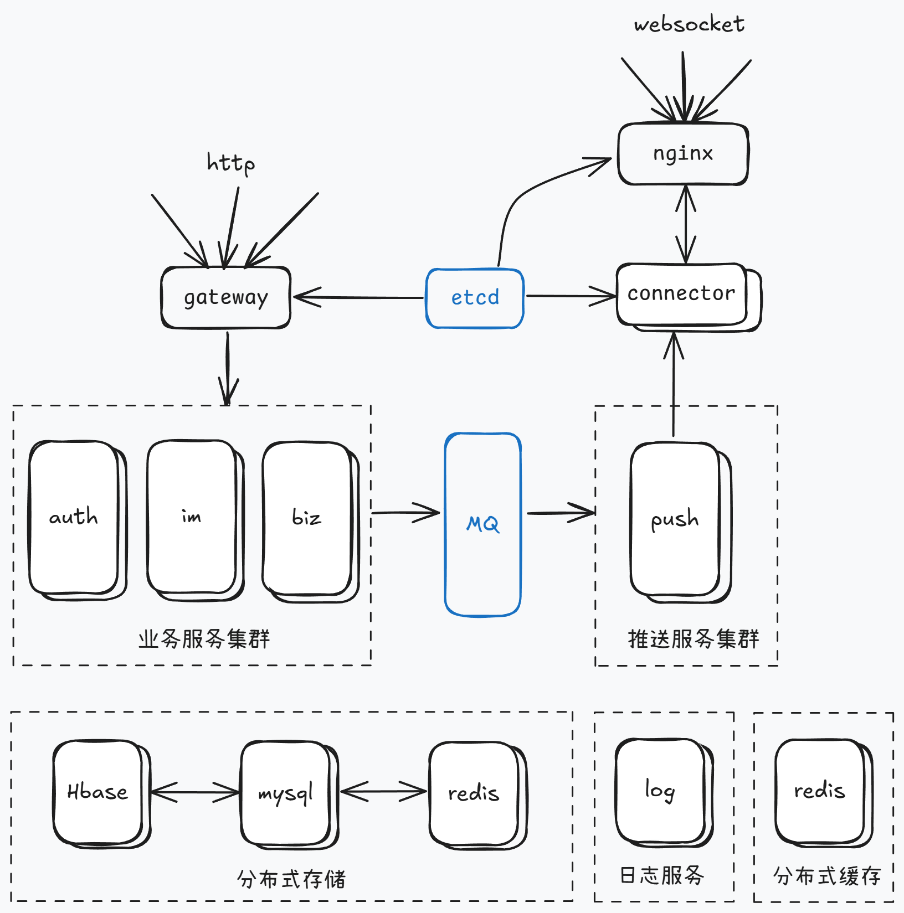

## 数据库表
- user(id,name,avatar,password,phone,created_at)
- space(id,name,avatar,owner_id,created_at)
- space_user(space_id,user_id,created_at)
- space_channel(space_id,channel_id,created_at)
- channel(id,name,avatar,owner_id,created_at)
- channel_user(channel_id,user_id,last_ack_message_id,created_at)
- channel_message(channel_id,message_id,from,type,body,created_at)
- message(id,from,to,type,body,created_at)

## 技术选型
fiber wire jwt grpc etcd mysql redis rocketMQ

## 架构设计

## 关键流程
- 单聊：A向B发送msg->推送msg至MQ->A收到ACK->IM server消费MQ->server写入存储库->将msg写入B收件箱
->若B在线,长连接推送->消息ACK后移出收件箱
- 群聊：A向B、C、D群发送msg->推送msg至MQ->A收到ACK->IM server消费MQ->server写入存储库->更新channel最新id
->若在线,长连接推送->更新群成员最后ACK消息ID

## 实施方案
- 离线消息存储使用读扩散与写扩散相结合，群聊记录每名群成员的最后ack消息id，单聊每个user一个收件箱
- 在线消息推送使用推模式，server推送后并不移出收件箱，客户端ack后移出
- 数据库冷热处理(future)

## 高并发
- 缓存在线用户的space和channel列表，减少db查询(redis缓存,缓存预热,缓存击穿,缓存不一致性,缓存锁)
- 缓存每个群聊的在线用户connector，便于群聊消息推送，同时缓存用户的lact_ack_message_id，减少db查询(写扩散)
- 用户收件箱使用redis存储(redis集群)

## 消息顺序一致性
- ~~采用id串行化，同一用户发送消息始终在同一节点(单方顺序一致性)，同一群聊消息始终在同一节点(群内顺序一致性)~~(并发度太低)
- 雪花id

## 功能
- 在线消息实时推送
- 离线消息缓存
- 消息支持漫游
- 未读消息红点

## 黑话
### 高性能实践方案
1、集群部署，通过负载均衡减轻单机压力。

2、多级缓存，包括静态数据使用 CDN、本地缓存、分布式缓存等，以及对缓存场景中的热点 key、缓存穿透、缓存并发、数据一致性等问题的处理。

3、分库分表和索引优化，以及借助搜索引擎解决复杂查询问题。

4、考虑 NoSQL 数据库的使用，比如 HBase、TiDB 等，但是团队必须熟悉这些组件，且有较强的运维能力。

5、异步化，将次要流程通过多线程、MQ、甚至延时任务进行异步处理。

6、限流，需要先考虑业务是否允许限流（比如秒杀场景是允许的），包括前端限流、Nginx 接入层的限流、服务端的限流。

7、对流量进行削峰填谷，通过 MQ 承接流量。

8、并发处理，通过多线程将串行逻辑并行化。

9、预计算，比如抢红包场景，可以提前计算好红包金额缓存起来，发红包时直接使用即可。

10、缓存预热，通过异步任务提前预热数据到本地缓存或者分布式缓存中。

11、减少 IO 次数，比如数据库和缓存的批量读写、RPC 的批量接口支持、或者通过冗余数据的方式干掉 RPC 调用。

12、减少 IO 时的数据包大小，包括采用轻量级的通信协议、合适的数据结构、去掉接口中的多余字段、减少缓存 key 的大小、压缩缓存 value 等。

13、程序逻辑优化，比如将大概率阻断执行流程的判断逻辑前置、For 循环的计算逻辑优化，或者采用更高效的算法。

14、各种池化技术的使用和池大小的设置，包括 HTTP 请求池、线程池（考虑 CPU 密集型还是 IO 密集型设置核心参数）、数据库和 Redis 连接池等。

15、JVM 优化，包括新生代和老年代的大小、GC 算法的选择等，尽可能减少 GC 频率和耗时。

16、锁选择，读多写少的场景用乐观锁，或者考虑通过分段锁的方式减少锁冲突。

### 高可用实践方案#
1、对等节点的故障转移，Nginx 和服务治理框架均支持一个节点失败后访问另一个节点。

2、非对等节点的故障转移，通过心跳检测并实施主备切换（比如 redis 的哨兵模式或者集群模式、MySQL 的主从切换等）。

3、接口层面的超时设置、重试策略和幂等设计。

4、降级处理：保证核心服务，牺牲非核心服务，必要时进行熔断；或者核心链路出问题时，有备选链路。

5、限流处理：对超过系统处理能力的请求直接拒绝或者返回错误码。

6、MQ 场景的消息可靠性保证，包括 producer 端的重试机制、broker 侧的持久化、consumer 端的 ack 机制等。

7、灰度发布，能支持按机器维度进行小流量部署，观察系统日志和业务指标，等运行平稳后再推全量。

8、监控报警：全方位的监控体系，包括最基础的 CPU、内存、磁盘、网络的监控，以及 Web 服务器、JVM、数据库、各类中间件的监控和业务指标的监控。

9、灾备演练：类似当前的“混沌工程”，对系统进行一些破坏性手段，观察局部故障是否会引起可用性问题。